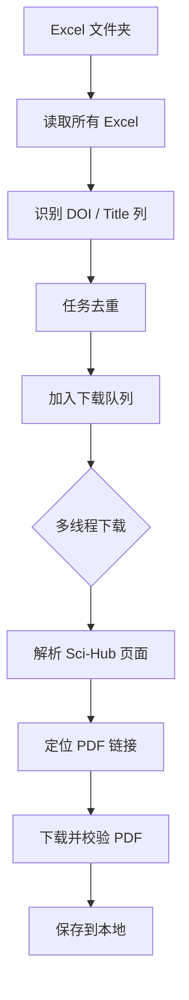
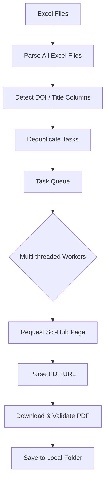

# 📚 Sci-Hub 批量论文下载器（Excel 驱动 · 多线程 · 自动域名修复）


> 一个面向**科研人员与研究生**的 **Sci-Hub 批量 PDF 下载工具**，
> 支持 **Excel 批量输入 DOI**、**多线程下载**、**自动切换可用域名**、**实时终端进度面板**，
> 适用于系统性文献收集与资料归档任务。

---

## ✨ 核心特性一览

| 功能模块          | 描述                                   |
| ------------- | ------------------------------------ |
| 📊 Excel 批量读取 | 自动扫描指定文件夹内的 `.xls / .xlsx` 文件        |
| 🔍 智能列识别      | 自动匹配 DOI / Title 多种字段命名              |
| ⚡ 多线程下载       | 支持并发下载，大幅提升效率                        |
| 🌐 域名自动修复     | 从 `domains.txt` 加载 Sci-Hub 域名并自动补全协议 |
| 🔁 自动重试       | 网络失败 / 服务器错误自动重试                     |
| 📂 文件去重       | 已存在 PDF 自动跳过                         |
| 🖥️ 实时终端 UI   | 类 TUI 风格进度面板，实时展示下载状态                |
| 📝 日志输出       | 成功 / 失败任务分别记录                        |

---

## 🧭 工作流程概览



---

## 📁 项目结构说明

```text
.
├── excel_files/            # 📥 放置待解析的 Excel 文件
│   ├── paper_list_1.xlsx
│   └── paper_list_2.xls
│
├── downloaded_pdfs/        # 📂 下载完成的 PDF 文件
│
├── domains.txt             # 🌐 Sci-Hub 域名列表（可选）
├── download_success.log    # ✅ 成功下载日志
├── download_error.log      # ❌ 失败下载日志
├── main.py                 # 🚀 主程序
└── README.md
```

---

## 📊 Excel 文件要求

程序会**自动识别列名**，无需严格格式，但需满足以下条件之一：

### ✅ 支持的 DOI 列名（不区分大小写）

```
doi
di
article_doi
doi_link
accession_number
```

### ✅ 支持的标题列名（可选）

```
title
article_title
ti
publication_title
article title
```

> ⚠️ 若未提供标题列，PDF 将以 DOI 作为文件名保存。

---

## 🚀 快速开始

### 1️⃣ 克隆项目

```bash
git clone https://github.com/yourname/scihub-batch-downloader.git
cd scihub-batch-downloader
```

### 2️⃣ 安装依赖

```bash
pip install requests beautifulsoup4 pandas openpyxl lxml
```

> Python ≥ **3.8** 推荐

---

### 3️⃣ 准备 Excel 文件

将所有包含 DOI 的 Excel 文件放入：

```text
./excel_files/
```

---

### 4️⃣（可选）配置 Sci-Hub 域名

编辑 `domains.txt`（支持注释）：

```text
# Sci-Hub domains
sci-hub.se
sci-hub.st
sci-hub.ru
```

程序将自动补全为：

```
https://sci-hub.se/
```

---

### 5️⃣ 运行程序

```bash
python main.py
```

---

## 🖥️ 运行界面示例（终端）

```text
================================================================================
 Sci-Hub 批量下载器 v3.1 (URL自动修复版) - 正在运行
================================================================================
 [总体进度]:  42.5% | 已完成: 85/200
 [详细统计]: ✅ 成功: 78 | ❌ 失败: 5 | 📂 跳过: 2
 [平均速度]: 1.63 篇/秒 | 耗时: 52.1 秒
--------------------------------------------------------------------------------
 [当前线程状态]:
   1. [Downloading PDF...] Deep Learning for Governance...
   2. [Connecting...] Algorithmic Accountability...
--------------------------------------------------------------------------------
```

---

## 🧠 设计亮点说明

### 🔹 智能鲁棒性设计

* 自动切换多个 Sci-Hub 域名
* HTTPS / HTTP 自动适配
* PDF 内容合法性校验（`%PDF-`）

### 🔹 并发安全

* `Queue` + `Lock` 管理多线程
* 实时任务状态可视化
* 避免重复写入与竞态条件

### 🔹 面向科研工作流

* Excel → DOI → PDF 的完整闭环
* 适合系统性文献综述、课题申报、博士论文准备

---

## ⚠️ 使用声明（重要）

> 本项目仅用于 **学术研究与技术学习目的**。
> 请用户 **自行遵守所在国家/地区的法律法规**。
> 作者不对任何滥用行为负责。

---

## 📌 可扩展方向（TODO）

* [ ] DOI 失败自动生成 Excel 报告
* [ ] 按期刊 / 年份 / 作者自动分目录
* [ ] 命令行参数支持（CLI 模式）
* [ ] 真正的 TUI（Rich / Textual）
* [ ] Docker 化部署

---

## 👤 作者

**沈哲**
政治学 / 科技治理 / 学术自动化工具

---


# 📚 Sci-Hub Batch PDF Downloader

### Excel-Driven · Multi-threaded · Auto Domain Fallback


> A **research-oriented batch downloader** for academic papers from Sci-Hub.
> Designed for **systematic literature collection**, supporting **Excel-based DOI input**,
> **multi-threaded downloads**, **automatic domain switching**, and a **real-time terminal dashboard**.

---

## ✨ Key Features

| Feature                     | Description                                        |
| --------------------------- | -------------------------------------------------- |
| 📊 Excel-based input        | Batch import DOIs from `.xls / .xlsx` files        |
| 🔍 Smart column detection   | Automatically detects DOI and title columns        |
| ⚡ Multi-threaded engine     | Concurrent downloads for high efficiency           |
| 🌐 Domain auto-repair       | Automatically loads and normalizes Sci-Hub domains |
| 🔁 Retry mechanism          | Handles network and server-side failures           |
| 📂 Duplicate skipping       | Existing PDFs are automatically skipped            |
| 🖥️ Real-time CLI dashboard | Live progress, speed, and task status              |
| 📝 Detailed logs            | Separate logs for success and failure              |

---

## 🧭 Workflow Overview



---

## 📁 Project Structure

```text
.
├── excel_files/             # 📥 Place Excel files here
│   ├── papers_1.xlsx
│   └── papers_2.xls
│
├── downloaded_pdfs/         # 📂 Downloaded PDF files
│
├── domains.txt              # 🌐 Sci-Hub domain list (optional)
├── download_success.log     # ✅ Successful downloads
├── download_error.log       # ❌ Failed downloads
├── main.py                  # 🚀 Main entry script
└── README.md
```

---

## 📊 Excel File Requirements

The program automatically detects column names.
Your Excel file **does not need a fixed schema**, but must include at least one DOI column.

### ✅ Supported DOI column variants (case-insensitive)

```
doi
di
article_doi
doi_link
accession_number
```

### ✅ Supported title column variants (optional)

```
title
article_title
ti
publication_title
article title
```

> If no title column is found, the PDF will be saved using the DOI as filename.

---

## 🚀 Quick Start

### 1️⃣ Clone the repository

```bash
git clone https://github.com/yourname/scihub-batch-downloader.git
cd scihub-batch-downloader
```

---

### 2️⃣ Install dependencies

```bash
pip install requests beautifulsoup4 pandas openpyxl lxml
```

> Recommended Python version: **3.8 or higher**

---

### 3️⃣ Prepare Excel files

Place all Excel files containing DOIs into:

```text
./excel_files/
```

---

### 4️⃣ (Optional) Configure Sci-Hub domains

Edit `domains.txt`:

```text
# Sci-Hub domains
sci-hub.se
sci-hub.st
sci-hub.ru
```

The program will automatically normalize them to:

```text
https://sci-hub.se/
```

---

### 5️⃣ Run the program

```bash
python main.py
```

---

## 🖥️ Terminal Interface Preview

```text
================================================================================
 Sci-Hub Batch Downloader v3.1 (Auto URL Repair)
================================================================================
 [Progress]:  42.5% | Completed: 85/200
 [Statistics]: ✅ Success: 78 | ❌ Failed: 5 | 📂 Skipped: 2
 [Average Speed]: 1.63 papers/sec | Elapsed: 52.1 seconds
--------------------------------------------------------------------------------
 [Active Tasks]:
   1. [Downloading PDF...] Deep Learning for Governance...
   2. [Connecting...] Algorithmic Accountability...
--------------------------------------------------------------------------------
```

---

## 🧠 Design Highlights

### 🔹 Robustness by Design

* Automatic fallback across multiple Sci-Hub domains
* HTTPS / HTTP compatibility
* PDF integrity check (`%PDF-` header validation)

### 🔹 Concurrency-Safe Architecture

* Thread-safe `Queue` and `Lock`
* Real-time processing list
* No race conditions on file writes

### 🔹 Research-Oriented Workflow

* Excel → DOI → PDF pipeline
* Ideal for literature reviews, grant preparation, and dissertation research

---

## ⚠️ Disclaimer

> This project is intended **for academic research and technical learning purposes only**.
> Users are responsible for complying with **local laws and regulations**.
> The author assumes **no liability** for misuse.

---

## 📌 Roadmap / Possible Extensions

* [ ] Export failed DOIs to Excel automatically
* [ ] Directory organization by journal / year
* [ ] Command-line arguments (CLI mode)
* [ ] Full TUI using Rich / Textual
* [ ] Dockerized deployment

---

## 👤 Author

**Zhe Shen**
Political Science · Technology Governance · Academic Automation

---
